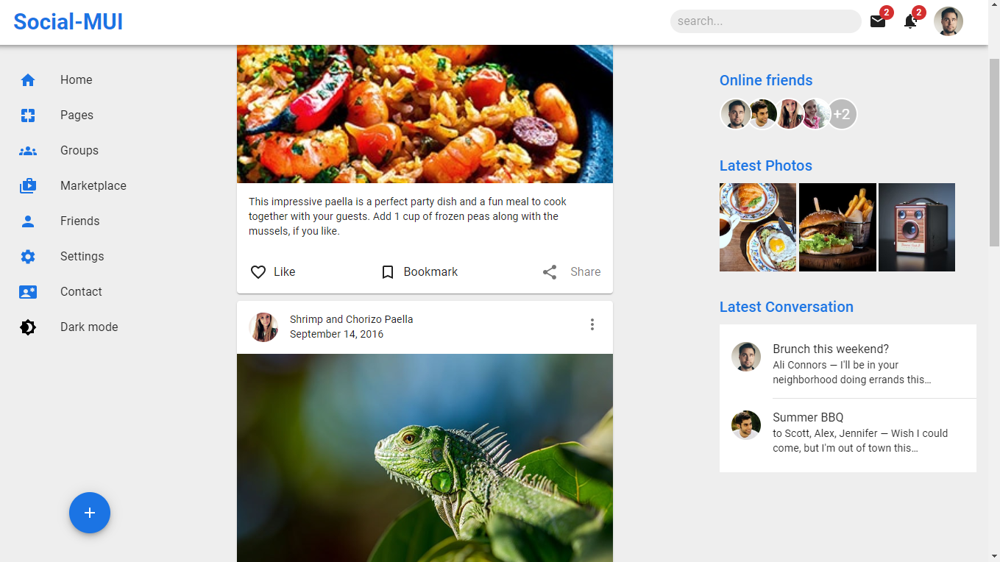
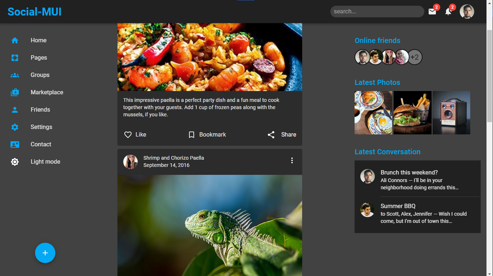

<h1 align="center">Social-MUI</h1>

This is a demo app to explore and test out the various MUI (Material-UI) components. MUI is a popular React UI library that provides a set of pre-built components that can be easily customized to fit your project's design needs.
You can check the <a href="https://social-mui.vercel.app/" target="_blank">live demo</a>.

 

  

